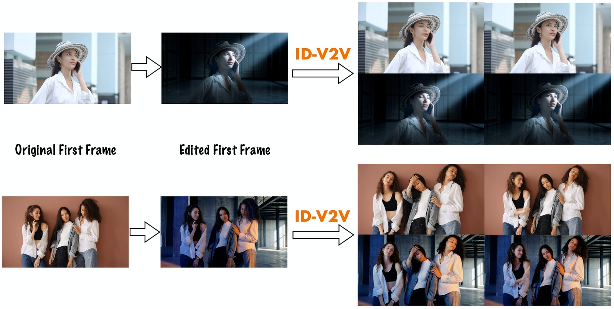

# ID-V2V: Identity-Preserving Video-to-Video Generation

[](https://eyeline-labs.github.io/ID-V2V/) [](https://arxiv.org/abs/2607.22830)

<b>🎉 Accepted to SIGGRAPH Asia 2026</b>

[Yuancheng Xu](https://yuancheng-xu.github.io/)<sup>1,2</sup>, [Mingming He](https://mingminghe.com/)<sup>2</sup>, [Pablo Salamanca](https://pablosalaman.ca/)<sup>1,2</sup>, [Li Ma](https://limacv.github.io/homepage/)<sup>2</sup>, [Yash Kant](https://yashkant.github.io/)<sup>1,2</sup>, [Emmett Steven](https://www.linkedin.com/in/emmettsteven)<sup>1</sup>, [Paul Debevec](https://www.pauldebevec.com/)<sup>1,2</sup>, [Ning Yu](https://ningyu1991.github.io/)<sup>1,2</sup> <br/>
<sup>1</sup>Netflix, <sup>2</sup>Eyeline Labs <br/>

# &#128064; Overview



**ID-V2V** is a research exploration for identity-preserving video restylization, and is for demonstration and inspiration purposes only. Given a **source video** plus a **stylized keyframe frame** (and optionally additional keyframes), it generates a new video where the scene, lighting, and style follow the keyframe(s) while strictly preserving the source characters' identity and performance such as subtle expressions, eye gaze, and body movement — enabling a *shoot first, restyle later* workflow for visual storytelling.

<video src="https://github.com/user-attachments/assets/6783f6d0-8993-4143-9a4c-dde2a2cfdeee" controls muted width="720"></video>

This repository contains:

- [Environment setup](#-environment-setup) — install the environment and download checkpoints
- [Model inference](#-model-inference) — the general preprocess → generate flow, with input/output structure
- [Use cases in detail](#-use-cases-in-detail) — recipes for restylization, imperfect keyframe, longer video, multiple keyframes, relighting
- [Two model variants](#-two-model-variants) — `idv2v` and an optional normal-depth-augmented variant
- [Repository layout](#-repository-layout)

# &#128295; Environment setup

A single unified `uv` environment covers preprocessing and inference.

```bash
git clone https://github.com/Eyeline-Labs/ID-V2V && cd ID-V2V
uv sync && source .venv/bin/activate
```

Python 3.10, torch 2.6+cu118, transformers 5.9, xfuser, flash-attn 2.7. Tested on 8× A100-80GB. `ffmpeg` is auto-installed on first run.

SAM3 is gated on Hugging Face, so log in once first, then download the checkpoints into `checkpoints/`:

```bash
hf auth login                          # paste a token with read access to facebook/sam3
bash scripts/download_checkpoints.sh   # idv2v.pth + SAM3 + Wan2.1's T5 + VAE + tokenizer + CLIP (~96 GB)
```

This fetches the **`idv2v.pth`** checkpoint (from [`Eyeline-Labs/ID-V2V`](https://huggingface.co/Eyeline-Labs/ID-V2V) → `checkpoints/idv2v.pth`) plus SAM3 and Wan2.1's T5 + VAE + tokenizer + CLIP — everything the default model needs. (Add `--skip-idv2v` if you already have the checkpoint, and set `MODEL_CHECKPOINT` to point at it.) See [`checkpoints/README.md`](checkpoints/README.md) for per-file sources.

# &#127916; Model inference

The ID-V2V model takes a **source video**, a **stylized first frame** (the look you want), an optional set of **keyframes**, and a **text prompt**, and generates a stylized video that follows the keyframe(s) while preserving the source's identity and performance. Running it is two steps: a **preprocessing** pass that derives the control signal from the source, followed by the **generation** step.

## Input: the sample directory

Every run reads its inputs from a single sample directory. A full example (with multiple keyframes and a longer source) looks like:

```
my_sample/
├── source.mp4                 (REQUIRED)  source video (any length)
├── stylized_first_frame.png   (REQUIRED)  the stylized first frame — the look you want (frame 0)
├── prompt.txt                 (REQUIRED)  text prompt
└── keyframes/                 (OPTIONAL)  extra frame-level anchors at chosen indices
    ├── 40.png                             filename N = inject at 0-based frame N (N ≥ 1)
    └── 80.png
```

`stylized_first_frame.png` pins the first frame; each `keyframes/<N>.png` pins frame `N`. You create these stylized frames with any image-editing tool (e.g. NanoBanana). The model generates clip by clip if the source video is longer than 81 frames. 

## Preprocessing

The default `idv2v` model conditions on a single control signal — **foreground-on-gray pixels** (the person segmented by SAM3, background grayed out). Derive it with:

```bash
# SAMPLE_DIR is the input directory (here the bundled restylization example; use your own laid out like my_sample/ above).
# SAM_PROMPT is the SAM3 text prompt for what to segment (default "person"; e.g. "head", "dog"):
SAMPLE_DIR=test_samples/restylization/two_sitting_woman SAM_PROMPT=person bash scripts/preprocess.sh
```

This writes the condition video to `<SAMPLE_DIR>/preprocessing/orig_pixel.mp4`. Relighting is the one exception — it needs no preprocessing; see [Use cases in detail](#-use-cases-in-detail).

## Generation

Run it on the same `SAMPLE_DIR` (uses `checkpoints/idv2v.pth` from Environment setup):

```bash
SAMPLE_DIR=test_samples/restylization/two_sitting_woman bash scripts/infer.sh
```

- **Multi-GPU** auto-enables when `GPU` is a comma-separated list with >1 id (e.g. `"0,1,2,3,4,5,6,7"`) — it launches `torchrun` with USP sequence parallel. For a single GPU set `GPU="0"` (plain `python` with CPU-offload; slower but fits one card).
- **Keyframes** are auto-discovered from `<SAMPLE_DIR>/keyframes/<N>.png`.
- **`MAX_NUM_FRAMES`** caps the output length. The video is generated in overlapping 81-frame clips (`NUM_FRAMES_PER_CLIP=81`), so a longer source simply produces more clips — no separate long-video mode.
- The checkpoint is memory-mapped on load, so all GPUs share one copy. `STAGE_CHECKPOINT_TO_SHM=true` (default) first copies the `.pth` into `/dev/shm` (RAM) for a big speedup on slow/network storage; it needs free RAM ≥ the checkpoint size — set it `false` if you hit CPU out-of-memory.

> The run prints a benign `diffsynth` warning (`using --use_multi_control_vace but only 1 control conditions is provided`). This is expected and safe to ignore.

## Output structure

```
my_sample/outputs/<run_name>/
│
│   ─── always saved ───
├── run_config.json                     resolved config (incl. prompt)
├── first_frame.png                     cropped stylized first frame actually used
├── original_video.mp4                  source re-encoded at output size, trimmed to output length
├── generated_video.mp4                 ← FINAL stitched output
├── flip_test.mp4                       plays generated, freezes periodically to A/B vs. source
│
│   ─── only when SAVE_VERBOSE=true (default) ───
├── condition_0.mp4                     the control signal as fed to the model
├── generated_clip0.mp4  generated_clip1.mp4  ...   per-clip generations
└── generated_video_withOrig.mp4        side-by-side (generated | source) viz
```

`<run_name>` defaults to `r{W}x{H}_f{F}_kf{N}_idv2v` (e.g. `r1280x720_f81_kf0_idv2v`; `F` = frames **per clip** = `NUM_FRAMES_PER_CLIP`, not the total length, so a multi-clip 240-frame run still shows `f81`; `N` = number of keyframes). Set `SAVE_VERBOSE=false` for the minimal output set. `flip_test.mp4` is the headline viz: it plays the generated video and pauses at up to 5 uniformly-spaced frames, alternating **Generated** (green pill) ↔ **Source** (red pill) for a quick A/B.

# &#129513; Use cases in detail

ID-V2V is driven by **keyframes** — stylized frames that you supply. The five recipes below cover the common ways to use the model. Each has a ready-to-run script in [`scripts/examples/`](scripts/examples) and a matching sample under [`test_samples/`](test_samples) that **doubles as the input template**: open a recipe's sample folder to see how to lay out your own inputs, then point `SAMPLE_DIR` at your own directory organized the same way and run that one script. Every sample also ships a `generated.mp4` showing the expected result. Finish [Environment setup](#-environment-setup) first (that step also fetches `checkpoints/idv2v.pth`).

## Restylization

**What it is.** Relight the human subject **and** regenerate the rest of the scene — background, objects, and overall style.

**Why you'd use it.** The most general use — reshape the world around a performance without re-filming. You supply a stylized first frame that changes the scene and background while keeping the character's pose and subtle expression, and ID-V2V carries that new look across the whole video while preserving the source's identity, expression, gaze, and lip-sync.

**Run it:**

```bash
# SAMPLE_DIR points at the input directory (swap it for your own, laid out like the sample):
SAMPLE_DIR=test_samples/restylization/two_sitting_woman bash scripts/examples/restylization.sh
```

This runs SAM3 preprocessing (foreground-on-gray condition) using "person" as the SAM3 prompt by default, then generates the video. Samples: `test_samples/restylization/`.

## Imperfect keyframe

**What it is.** The same restylization flow, but with a first frame that does **not** perfectly match the source.

**Why you'd use it (and why it matters).** Image-editing models like NanoBanana often can't hold the exact pose or expression when they restyle a frame, so the stylized first frame ends up **non-aligned** with the source video's first frame. That's fine — you don't need a pixel-perfect keyframe. Frame 0 follows your imperfect keyframe, but from the **second frame onward** ID-V2V re-aligns to the source video's identity and performance, correcting the mismatch automatically.

**Run it** — identical command and script to restylization; only the sample differs:

```bash
SAMPLE_DIR=test_samples/non_aligned_keyframe/woman_phone bash scripts/examples/restylization.sh
```

Samples: `test_samples/non_aligned_keyframe/`.

## Longer video

**What it is.** Generation for a source video longer than a single 81-frame clip. ID-V2V generates the video **clip by clip**, conditioning each new clip on the **end of the previous clip** (the frame where they overlap), so the clips join seamlessly into one continuous, drift-controlled video.

**Run it:**

```bash
SAMPLE_DIR=test_samples/longer_video/woman_dancing bash scripts/examples/longer_video.sh
```

The example defaults to `MAX_NUM_FRAMES=240` (→ 3 clips); set it to whatever length you want. Preprocessing and generation are the same as restylization. Samples: `test_samples/longer_video/`. For the best performance, we recommend using more keyframes when the source video is longer.

## Multiple keyframes

**What it is.** Pinning more than just the first frame.

**Why you'd use it.** Sometimes one keyframe isn't enough control — e.g. you want to fix both the **first and last** frame (or a mid-point) so the video lands exactly where you intend. Drop edited frames into `keyframes/<N>.png` and the model pins each one. The keyframe can be any frame.

**Run it:**

```bash
SAMPLE_DIR=test_samples/first_last_frame/two_women_spotlight bash scripts/examples/first_last_frame.sh
```

The sample pins both ends — `stylized_first_frame.png` (first frame) + `keyframes/80.png` (last frame of an 81-frame clip), which `infer.sh` auto-discovers. Samples: `test_samples/first_last_frame/`.

## Relighting

**What it is.** Change **only the lighting**, keeping the full scene — both the foreground human subjects and the background — exactly as shot.

**Why you'd use it (and how it differs from restylization).** Relighting is a more restricted case of restylization: whereas restylization can edit the background and the overall scene and substantially change the video's appearance, relighting alters nothing but the illumination. To do this, use an image-editing model to relight the first frame *while keeping everything, including the background*, then feed it to ID-V2V **directly** — with no SAM3 mask, no grayed-out background, and **no preprocessing at all**. The raw source video is used as the control, so the whole scene is preserved and only the lighting changes.

**Run it:**

```bash
SAMPLE_DIR=test_samples/relighting/two_sitting_woman bash scripts/examples/relighting.sh
```

This skips preprocessing entirely and uses `scripts/infer_relighting.sh` (the raw source video is the condition). Samples: `test_samples/relighting/`.

# &#129504; Two model variants

Everything above uses the **default `idv2v`** model, which is driven by a single per-frame VACE control signal. There is also an alternate variant that adds two more conditions:

| Variant | VACE conditions | Preprocess | Inference | Checkpoint |
|---|---|---|---|---|
| **`idv2v`** — *default, recommended* | **1**: foreground-on-gray pixels (SAM3-segmented person) | `scripts/preprocess.sh` | `scripts/infer.sh` | `idv2v.pth` |
| `idv2v_with_normal_depth` — *alternate* | **3**: foreground-on-gray pixels **+ surface-normals (DAViD) + depth (DepthAnything-V2)** | `scripts/idv2v_with_normal_depth/preprocess_with_depth.sh` | `scripts/idv2v_with_normal_depth/infer_with_depth.sh` | `idv2v_with_normal_depth.pth` |

The default `idv2v` keeps (relights) whatever is inside the SAM3 mask (the segmented person) and freely regenerates the rest of the frame from the text prompt. `idv2v_with_normal_depth` additionally constrains those other regions with the source video's depth — reach for it when you want that depth control, but only if the source video's depth already matches the scene you intend to generate. Its checkpoint plus two extra preprocessing models (DAViD, DepthAnything-V2) are fetched by adding `--with-depth` to the download:

```bash
bash scripts/download_checkpoints.sh --with-depth   # + idv2v_with_normal_depth.pth + DAViD + DepthV2 (~75 GB)
```

Its preprocessing and inference mirror the default flow via `scripts/idv2v_with_normal_depth/preprocess_with_depth.sh` and `scripts/idv2v_with_normal_depth/infer_with_depth.sh`; it saves `condition_0/1/2.mp4` (pixels + normals + depth) and uses the `..._idv2v_with_normal_depth` run-name suffix. The two checkpoints are **different, non-interchangeable weights** with the same architecture, so loading the wrong `.pth` into a script does **not** error — it silently produces poor output. Match the checkpoint to the script. See [`checkpoints/README.md`](checkpoints/README.md).

# &#128193; Repository layout

```
ID-V2V_public/
├── scripts/
│   ├── download_checkpoints.sh   fetch public weights (default: SAM3 + Wan; --with-depth adds DAViD + DepthV2)
│   ├── preprocess.sh             idv2v: SAM3 + origPixel (foreground-on-gray condition)
│   ├── infer.sh                  idv2v: single-condition video generation
│   ├── infer_relighting.sh       idv2v relighting: raw source as the condition (no preprocessing)
│   ├── examples/                 one runnable script per recipe (restylization, relighting, longer_video, first_last_frame)
│   └── idv2v_with_normal_depth/  ALTERNATE idv2v_with_normal_depth variant (secondary):
│       ├── preprocess_with_depth.sh   SAM3 + origPixel + DAViD + DepthV2
│       └── infer_with_depth.sh        three-condition video generation
├── src/idv2v/
│   ├── preprocess/               SAM3, origPixel, DAViD, DepthV2
│   └── inference/                pipeline.py (shared 1–3 condition engine) + flip_test.py
├── diffsynth_studio/             Wan pipeline
├── test_samples/                 ready-to-run examples grouped by use case (source.mp4 + stylized_first_frame.png + prompt.txt + generated.mp4)
├── checkpoints/                  gitignored — populated by download_checkpoints.sh
```

# &#128591; Acknowledgements

Builds on [DiffSynth-Studio](https://github.com/modelscope/DiffSynth-Studio) (Wan series), [SAM3](https://huggingface.co/facebook/sam3) (segmentation), [DAViD](https://github.com/microsoft/DAViD) (surface normals, `idv2v_with_normal_depth` only), [DepthAnything v2](https://github.com/DepthAnything/Depth-Anything-V2) (depth, `idv2v_with_normal_depth` only), and [Stable-Video-Infinity](https://github.com/vita-epfl/Stable-Video-Infinity) (long-video generation).
